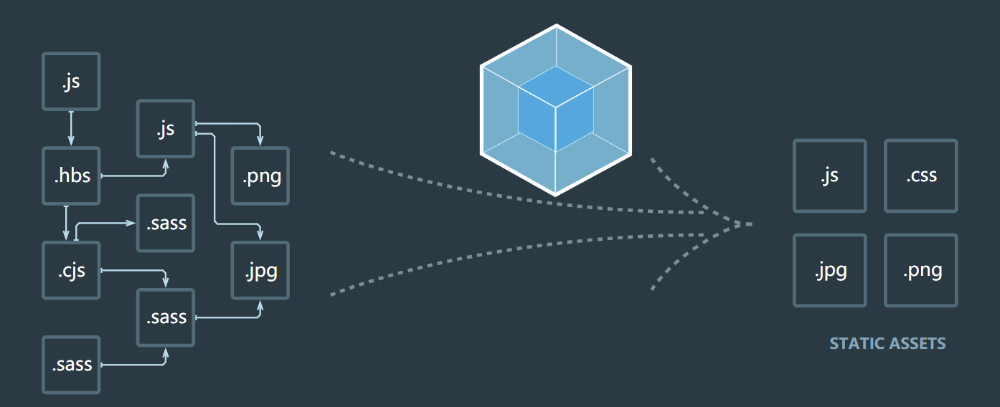
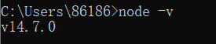
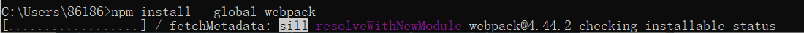

# WEBPACK

## 1.什么是webpack

​		从本质上讲，webpack是一个线代的javascript应用的静态模块打包工具

## 2.webpack安装

​		webpack运行需要node环境，需要npm(node packages manager)来管理各种以来的包。

​		安装webpack首先需要安装node.js, npm;

​		查看自己的node版本：在cmd中输入 node -v;

​		全局安装webpack：在cmd中输入 npm install --global webpack。

​		提示要安装CLI，输入yes。

​		输入webpack --version查看是否安装完成。

​		局部安装webpack（后面使用）：在cmd中输入 npm install --save-dev webpack

## 3.webpack基本使用

​		文件架构：

​	